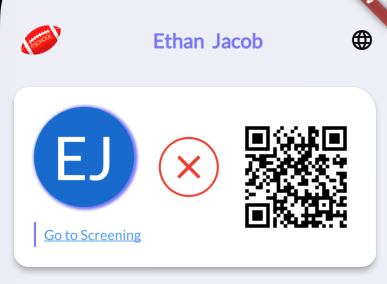
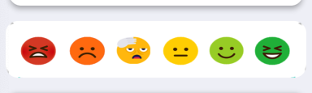
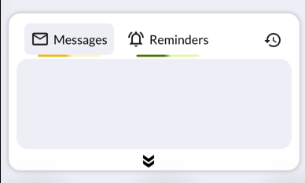
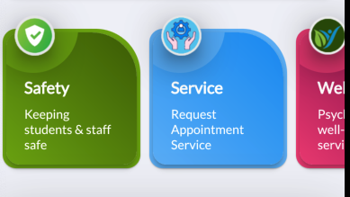

# Home
- This is the home screen for all where users can navigate to different features.
- User able to see the daily check in status on top.
  
    

- If user already perform the daily screening will see the green check mark. If not user can directly navigate to daily screening screen to perform that.
- We provide a barcode on the home screen which help other users to scan and know the screening status.
- User can perform a new check-in which help school admin to know the mental state of any user. After tapping on the beloe showed icon user can directly submit the status. 

    

- User can see any messages / reminders directly on the home screen. User also able to see the details about that notification after tap on it.
- Also a history button is there to see the past history of messages or reminders.

    

- On the bottom user can navigate to differnet features / services to perform multiple actions.

    
        